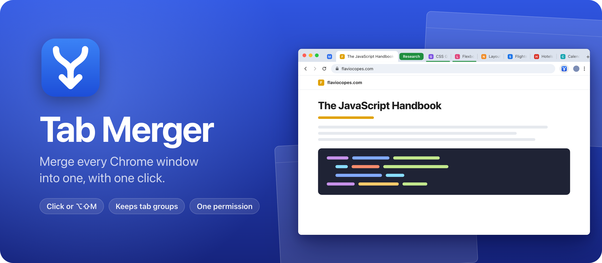
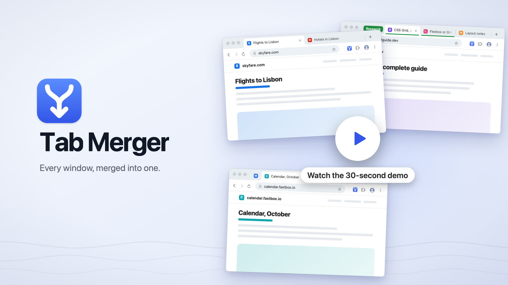

Tab Merger is a Chrome extension that moves the tabs of every open window into the one you're using. Click its toolbar button or press `Alt+Shift+M`, and five windows become one.

Safari has a Merge All Windows command. Chrome doesn't, so without an extension you drag tabs across one at a time.

<!-- After the launch post is live, add these two lines:

Read the announcement and watch the 30-second demo on my blog: [<post title>](https://flaviocopes.com/<slug>/).

[](https://flaviocopes.com/<slug>/)
-->

## Install

Tab Merger isn't on the Chrome Web Store, so you load it into Chrome yourself. It takes a minute.

1. Get `Tab-Merger-1.0.0.zip` from the [latest release](https://github.com/flaviocopes/tabmerger/releases/latest) and unzip it.
2. Move the `Tab-Merger-1.0.0` folder somewhere it can stay, like your Documents folder. Chrome runs the extension from that folder, so if you delete it, Tab Merger is gone.
3. Open `chrome://extensions` and turn on **Developer mode** in the top right corner.
4. Click **Load unpacked** and pick that folder.
5. Click the puzzle icon in the toolbar and pin Tab Merger, so it's one click away.

### Updates

An extension you load this way doesn't update on its own. When there's a new release, unzip it and copy its files into your Tab Merger folder, replacing the old ones. Then click the reload arrow on the Tab Merger card in `chrome://extensions`. Since the folder is the same, Chrome keeps your shortcut and the pinned button.

To hear about new versions, click **Watch** on this repo, then **Custom** and **Releases**.

### The shortcut

The shortcut is `Alt+Shift+M` on Windows and Linux, and `Option+Shift+M` on a Mac. To change it, open `chrome://extensions/shortcuts`.

Go there too if the shortcut doesn't work. Chrome skips a suggested shortcut when another extension already uses it, and leaves it empty.

## Features

- Every other window's tabs move into the window you're using, and the empty windows close.
- Tabs keep their order. They arrive window by window, in the order they had.
- Tab groups move whole, with their name and color.
- Pinned tabs stay pinned. Chrome unpins a tab when it moves to another window, so Tab Merger pins it again.
- Incognito tabs never mix with regular ones. If you allow Tab Merger in incognito and use it in an incognito window, it merges only the incognito windows.
- Popups and installed web app windows are left alone.

## Privacy

Tab Merger asks Chrome for one permission, `tabGroups`, which lets it move tab groups. It can't see the address or the title of your tabs, and it can't read your pages or your history.

It never goes online, and there are no accounts or analytics.

## Build it from source

There's no build step. Clone the repo and load the folder itself with **Load unpacked**, as in the install steps. After you edit a file, click the reload arrow on the Tab Merger card.

To make the release zip, run:

```sh
scripts/build-release.sh
```

It copies the extension files into `dist/Tab-Merger-<version>.zip` and prints its SHA-256. The same commit always gives the same zip, so you can check that a release matches its tag.

## Development

The test loads the extension into Playwright's Chromium. It opens three windows with a pinned tab and a tab group, runs a merge, and checks the result. You need Node.js:

```sh
npm install
npx playwright install chromium
npm test
```

The banner comes from `scripts/banner.html`. Render it again with `node scripts/render-banner.mjs`. The icons are rendered from `icons/icon.svg`.

Working with an AI coding agent? Point it at [AGENTS.md](AGENTS.md). It has the commands and the rules to follow.

## How it works

The whole extension is `background.js`, a service worker of about 40 lines. The shortcut is Chrome's `_execute_action` command, so the button and the shortcut fire the same `action.onClicked` event, with the window you're in. Tab Merger then goes through every other normal window with the same incognito state. It moves runs of ungrouped tabs with `chrome.tabs.move` and each group with `chrome.tabGroups.move`, and pins the pinned tabs again at the end.

Chrome 137 stopped accepting the `--load-extension` flag, so the test starts Chromium with `--enable-unsafe-extension-debugging` and loads the extension through the DevTools protocol's `Extensions.loadUnpacked`. Then it calls the merge function inside the extension's service worker.

## License

[MIT](LICENSE)
